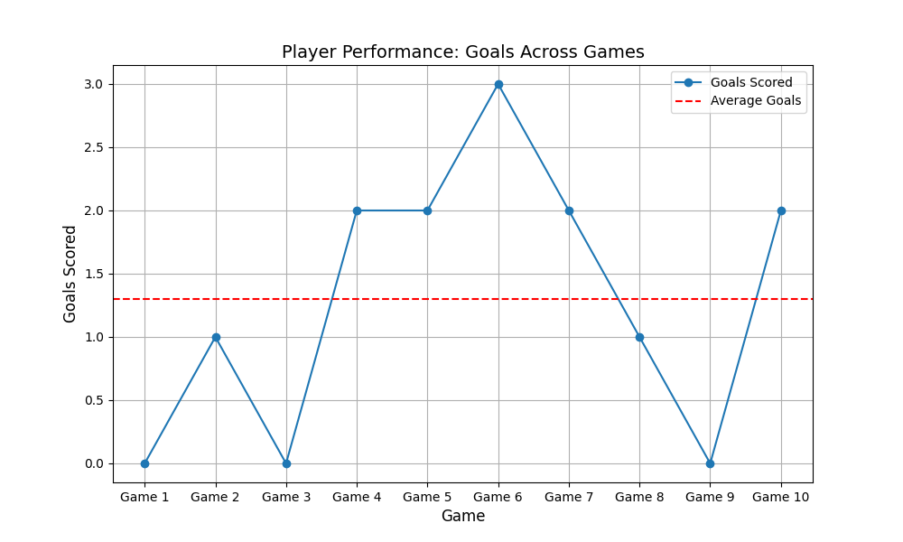

# Player Performance Visualization

## Overview
This project visualizes a player's scoring trends across 10 games, highlighting goals scored, significant milestones, and performance trends. It provides valuable insights for coaches and analysts to understand player contributions over time.

## Features
- Detailed scoring trends over 10 games.
- Trendline analysis and key data annotations.
- Visualized insights for sports performance analysis.

## Tools & Technologies
- Python
- Matplotlib
- Pandas
- Seaborn

## Visuals


## How to Run
1. Clone the repository:
   ```
   git clone https://github.com/jsonRUHLS/player-performance-visualization.git
   ```
2. Install dependencies:
   ```
   pip install -r requirements.txt
   ```
3. Run the script:
   ```
   python generate_visualization.py
   ```

## Code Structure
- **code/**: Python scripts for data processing and visualization.
- **data/**: Mock datasets (CSV files).
- **charts/**: Generated visualizations.

## Live Demo
[Player Performance Visualization](https://jsonRUHLS.github.io/player-performance-visualization/)

## License
This project is licensed under the MIT License. See the LICENSE file for details.
